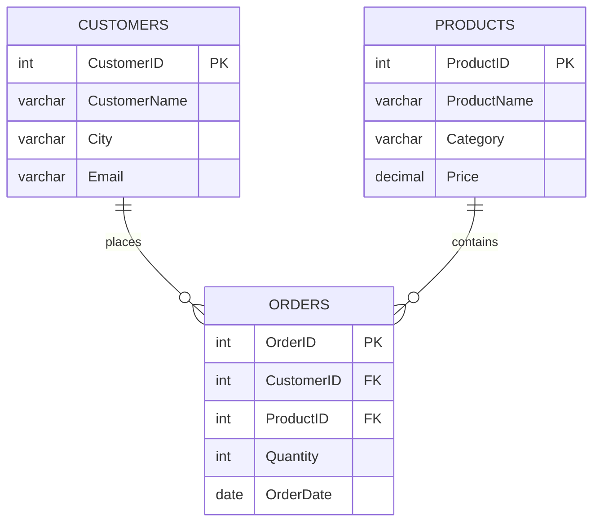

# ShopDB Practice Hub 🛒
Welcome to the **ShopDB Practice Hub**! This repository is designed to help you practice and master database queries using Microsoft SQL Server (T-SQL).

ShopDB is a lightweight, relational database designed to simulate a retail shop, containing information about **Customers**, **Products**, and **Orders**.

---

## 🗺️ Database Schema (ERD)

Below is the Entity Relationship Diagram showing how the tables are connected:



---

## 🛠️ Setup & Schema Creation

To set up the database on your local SQL Server instance, execute the following script. This script creates the database `ShopDB`, the three tables with appropriate primary and foreign key constraints, and inserts sample data.

> [!NOTE]
> This matches the schema and data defined in [ShopDb.sql](file:///Users/raghuballu/Documents/raghu_works/Databases/SQL%20Server/ShopDb.sql).

```sql
-- Create Database
CREATE DATABASE ShopDB;
GO

USE ShopDB;
GO

-- Create Customers Table
CREATE TABLE Customers (
    CustomerID INT PRIMARY KEY,
    CustomerName VARCHAR(100),
    City VARCHAR(50),
    Email VARCHAR(100)
);
GO

-- Create Products Table
CREATE TABLE Products (
    ProductID INT PRIMARY KEY,
    ProductName VARCHAR(100),
    Category VARCHAR(50),
    Price DECIMAL(10,2)
);
GO

-- Create Orders Table
CREATE TABLE Orders (
    OrderID INT PRIMARY KEY,
    CustomerID INT,
    ProductID INT,
    Quantity INT,
    OrderDate DATE,
    FOREIGN KEY (CustomerID) REFERENCES Customers(CustomerID),
    FOREIGN KEY (ProductID) REFERENCES Products(ProductID)
);
GO

-- Insert Sample Customers
INSERT INTO Customers VALUES
(1, 'Raghu', 'Chennai', 'raghu@gmail.com'),
(2, 'Arjun', 'Bangalore', 'arjun@gmail.com'),
(3, 'Priya', 'Hyderabad', 'priya@gmail.com'),
(4, 'Kiran', 'Mumbai', 'kiran@gmail.com'),
(5, 'Sneha', 'Pune', 'sneha@gmail.com');
GO

-- Insert Sample Products
INSERT INTO Products VALUES
(101, 'Laptop', 'Electronics', 55000),
(102, 'Mobile', 'Electronics', 25000),
(103, 'Keyboard', 'Accessories', 1500),
(104, 'Mouse', 'Accessories', 700),
(105, 'Monitor', 'Electronics', 12000),
(106, 'Headphones', 'Accessories', 3000);
GO

-- Insert Sample Orders
INSERT INTO Orders VALUES
(1001, 1, 101, 1, '2025-01-10'),
(1002, 1, 104, 2, '2025-01-11'),
(1003, 2, 102, 1, '2025-01-12'),
(1004, 3, 103, 3, '2025-01-13'),
(1005, 4, 105, 1, '2025-01-14'),
(1006, 2, 106, 2, '2025-01-15'),
(1007, 5, 102, 1, '2025-01-16'),
(1008, 3, 101, 1, '2025-01-17'),
(1009, 4, 104, 5, '2025-01-18'),
(1010, 1, 106, 1, '2025-01-19');
GO
```

---

## 📝 SQL Practice Queries

Test your skills by trying to write queries for the tasks below. If you get stuck, click the drop-down to see the solution and explanation.

### 🟢 Level 1: Basic Queries

#### Q1. Show products with a price greater than 10,000
Find all columns of products that cost more than `10,000`.

<details>
<summary>💡 View Solution</summary>

```sql
SELECT * 
FROM Products 
WHERE Price > 10000;
```
* **Concept:** Standard `SELECT` with a basic filter using `WHERE`.
</details>

#### Q2. Show customers from Chennai
Find all customers residing in the city of `'Chennai'`.

<details>
<summary>💡 View Solution</summary>

```sql
SELECT * 
FROM Customers 
WHERE City = 'Chennai';
```
* **Concept:** Filtering string literals in `WHERE`.
</details>

#### Q3. Show orders placed after 2025-01-15
List all orders that were placed strictly after `January 15, 2025`.

<details>
<summary>💡 View Solution</summary>

```sql
SELECT * 
FROM Orders 
WHERE OrderDate > '2025-01-15';
```
* **Concept:** Filtering dates. In SQL Server, dates formatted as `YYYY-MM-DD` string literals are automatically converted to date formats.
</details>

---

### 🟡 Level 2: Joins & Aggregations

#### Q4. Show customer name and their Order IDs
List the customer names along with the order IDs they placed.

<details>
<summary>💡 View Solution</summary>

```sql
SELECT c.CustomerName, o.OrderID 
FROM Customers c
INNER JOIN Orders o ON c.CustomerID = o.CustomerID;
```
* **Concept:** Using `INNER JOIN` to link table columns using foreign key constraints.
</details>

#### Q5. Show product name and total quantity ordered
Retrieve all product names and aggregate the sum of quantities ordered for each.

<details>
<summary>💡 View Solution</summary>

```sql
SELECT p.ProductName, SUM(o.Quantity) AS TotalQuantity
FROM Orders o
INNER JOIN Products p ON o.ProductID = p.ProductID
GROUP BY p.ProductName;
```
* **Concept:** Combining `INNER JOIN`, aggregate function `SUM()`, and `GROUP BY`.
</details>

#### Q6. Find total orders placed by each customer
List each customer (ID and Name) and count how many orders they have placed, sorted in descending order of total orders.

<details>
<summary>💡 View Solution</summary>

```sql
SELECT c.CustomerID, c.CustomerName, COUNT(o.OrderID) AS TotalOrders 
FROM Customers c
INNER JOIN Orders o ON c.CustomerID = o.CustomerID
GROUP BY c.CustomerID, c.CustomerName 
ORDER BY TotalOrders DESC;
```
* **Concept:** Aggregation with `COUNT()`, grouping by multiple fields, and sorting with `ORDER BY ... DESC`.
</details>

#### Q7. Find total quantity sold for each product
Show the product name along with the aggregate of the quantity ordered.

<details>
<summary>💡 View Solution</summary>

```sql
SELECT p.ProductName, SUM(o.Quantity) AS TotalQuantity 
FROM Orders o
INNER JOIN Products p ON o.ProductID = p.ProductID
GROUP BY p.ProductID, p.ProductName;
```
* **Concept:** Using product id and name inside `GROUP BY` to ensure uniqueness.
</details>

#### Q8. Find customers who ordered a 'Laptop'
List all customer names who bought a product named `'Laptop'`.

<details>
<summary>💡 View Solution</summary>

```sql
SELECT DISTINCT c.CustomerName, p.ProductName 
FROM Customers c
INNER JOIN Orders o ON c.CustomerID = o.CustomerID
INNER JOIN Products p ON o.ProductID = p.ProductID 
WHERE p.ProductName = 'Laptop';
```
* **Concept:** Multi-table join (`Customers` -> `Orders` -> `Products`) and filtering on product name.
</details>

#### Q9. Customers who have never placed an order
Find all customers who haven't made any purchases yet.

<details>
<summary>💡 View Solution</summary>

```sql
SELECT c.CustomerName, o.OrderID 
FROM Customers c
LEFT JOIN Orders o ON c.CustomerID = o.CustomerID 
WHERE o.OrderID IS NULL;
```
* **Concept:** `LEFT JOIN` keeps all records from the left table (`Customers`). By checking `WHERE o.OrderID IS NULL`, we filter for customers with no matching order records.
</details>

---

### 🔴 Level 3: Advanced Queries (CTEs, Windows & Top-N)

#### Q10. Find the second highest priced product
Retrieve the product that is the second most expensive. Explain multiple approaches.

<details>
<summary>💡 View Solution</summary>

##### Method 1: Using OFFSET & FETCH (SQL Server 2012+)
```sql
SELECT ProductID, ProductName, Category, Price 
FROM Products
ORDER BY Price DESC
OFFSET 1 ROWS FETCH NEXT 1 ROWS ONLY;
```
* *Pros:* Simple syntax and highly performant.
* *Cons:* If there are ties for the highest price, it will skip only the single highest row.

##### Method 2: Using CTE & DENSE_RANK()
```sql
WITH RankProductPrices AS (
    SELECT *, 
           DENSE_RANK() OVER (ORDER BY Price DESC) AS PriceRank 
    FROM Products
)
SELECT ProductID, ProductName, Category, Price 
FROM RankProductPrices 
WHERE PriceRank = 2;
```
* *Pros:* Handles duplicate prices gracefully. If multiple products share the highest price, `DENSE_RANK` assigns rank `1` to all of them, and rank `2` to the next highest price.
</details>

#### Q11. Top 3 most sold products
List the top 3 products based on the total quantity sold.

<details>
<summary>💡 View Solution</summary>

```sql
SELECT TOP 3 p.ProductName, SUM(o.Quantity) AS TotalSold 
FROM Products p
INNER JOIN Orders o ON p.ProductID = o.ProductID
GROUP BY p.ProductName
ORDER BY TotalSold DESC;
```
* **Concept:** `TOP n` keyword in SQL Server, combined with aggregations.
</details>

#### Q12. Find the customer who spent the most money
Determine the customer who generated the highest revenue (Sum of `Quantity * Price`).

<details>
<summary>💡 View Solution</summary>

```sql
SELECT TOP 1 c.CustomerName, SUM(o.Quantity * p.Price) AS TotalSpent 
FROM Customers c
INNER JOIN Orders o ON c.CustomerID = o.CustomerID
INNER JOIN Products p ON o.ProductID = p.ProductID
GROUP BY c.CustomerName, c.CustomerID
ORDER BY TotalSpent DESC;
```
* **Concept:** Calculated fields inside aggregates `SUM(o.Quantity * p.Price)`, joining three tables, sorting, and retrieving the top record.
</details>

---

## 💡 MS SQL Server Best Practices & Tips

As you practice writing queries, keep these key SQL Server-specific concepts in mind:

1. **Transaction Control (`GO`):** The `GO` statement is not a T-SQL command; it is a batch separator recognized by SQL Server utilities (like SSMS) to submit the preceding batch of SQL statements to the server.
2. **Paging using `OFFSET-FETCH`:** Always pair `OFFSET` with an `ORDER BY` clause. It is a modern replacement for complex nested queries that was introduced in SQL Server 2012.
3. **Window Functions:** Functions like `ROW_NUMBER()`, `RANK()`, and `DENSE_RANK()` allow you to compute rankings and running totals without complex self-joins.
4. **Aliasing:** Always alias tables when joining (e.g., `FROM Customers c INNER JOIN Orders o`) to keep queries clean and clear.
